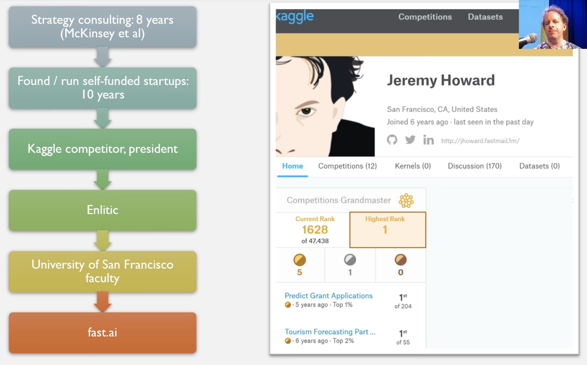
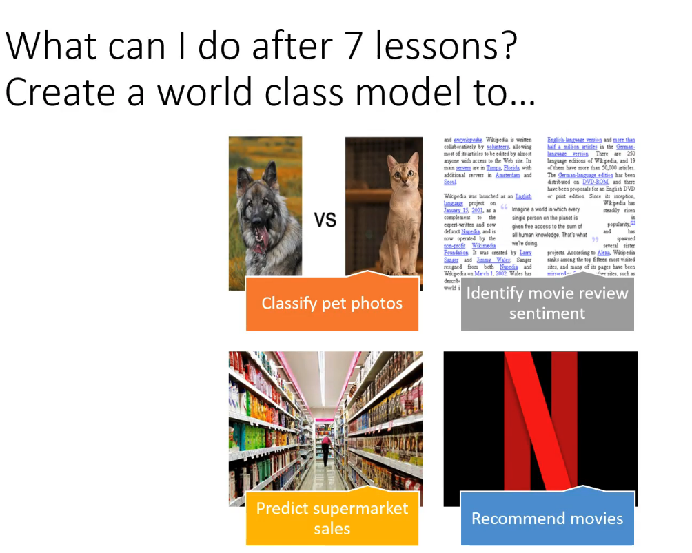
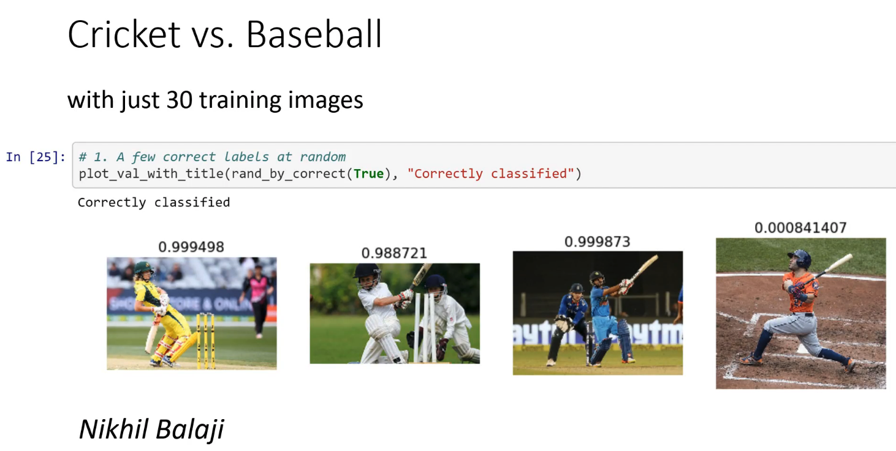
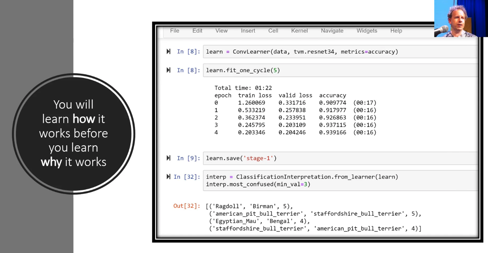

# Lesson 1
[Webpage](http://course-v3.fast.ai/) / [Video](https://www.youtube.com/watch?v=7hX8yKCX6xM)


[[52:22](https://youtu.be/7hX8yKCX6xM?t=3142)]

Weocome!  

Make sure your GPU environment is set up and you can run Jupyter Notebook

[00_notebook_tutorial.ipynb](https://github.com/fastai/course-v3/blob/master/nbs/dl1/00_notebook_tutorial.ipynb)


[[53:21](https://youtu.be/7hX8yKCX6xM?t=3201)]

Four shortcuts:

- <kbd>Shift</kbd>+<kbd>Enter</kbd>: Runs the code or markdown on a cell

- <kbd>Up Arrow</kbd>+<kbd>Down Arrow</kbd>: Toggle across cells

- <kbd>b</kbd>: Create new cell

- <kbd>0</kbd>+<kbd>0</kbd>: Restart Kernel


[[55:04](https://youtu.be/7hX8yKCX6xM?t=3304)] 

Jupyter Notebook is a really interesting device for data scientists because it lets you run interactive experiments and give you not just a static piece of information but something you can interactively experiment with.

How to use notebooks and the materials well based on the last three years of experience:

1. Just watch a lesson end to end. 
   - Don't try to follow along because it's not really designed to go the speed where you can follow along. It's designed to be something where you just take in the information, you get a general sense of all the pieces, how it all fits together.
   - Then you can go back and go through it more slowly pausing the video, trying things out, making sure that you can do the things that I'm doing and you can try and extend them to do things in your own way.
   - Don't try and stop and understand everything the first time. 

[[56:49](https://youtu.be/7hX8yKCX6xM?t=3409)]

You can do world-class practitioner level deep learning. 


Main places to be looking for things are:
- [http://course-v3.fast.ai/](http://course-v3.fast.ai/)
- [https://forums.fast.ai/](https://forums.fast.ai/latest)

[[57:45](https://youtu.be/7hX8yKCX6xM?t=3465)]

A little bit about why we should listen to Jeremy:



[[59:05](https://youtu.be/7hX8yKCX6xM?t=3545)]

Using machine learning to do userful things:


[[59:44](https://youtu.be/7hX8yKCX6xM?t=3584)]



If you follow along with 10 hours a week or so approach for the 7 weeks, by the end, you will be able to:
 
1. Build an image classification model on pictures that you choose that will work at a world class level
2. Classify text using whatever datasets you're interested in
3. Make predictions of commercial applications like sales
4. Build recommendation systems such as the one used by Netflix

Not toy examples of any of these but actually things that can come top 10 in Kaggle competitions, that can beat everything that's in the accademic community. 

The prerequisite is one year of coding and high school math.


[[1:01:23](https://youtu.be/7hX8yKCX6xM?t=3683)]

What people say about deep learning which are either pointless or untrue:


- It's not a black box. It's really great for interpreting what's going on.
- It does not need much data for most practical applications.
- You don't need a PhD. Rachel has one so it doesn't actually stop you from doing deep learning if you have a PhD.
- It can be used very widely for lots of different applications, not just for vision.
- You don't need lots of hardware. 36 cents an hour server is more than enough to get world-class results for most problems.
- It is true that maybe this is not going to help you build a sentient brain, but that's not our focus. We are focused on solving interesting real-world probblems.

[[1:02:42](https://youtu.be/7hX8yKCX6xM?t=3762)]



Baseball vs. Cricket - An example by Nikhil of what you are going to be able to do by the end of lesson 1:


[[1:03:20](https://youtu.be/7hX8yKCX6xM?t=3800)]



We are going to start by looking at code which is different to mamy of academic courses. We are going to learn to build a useful thing today. That means that at the end of today, you won't know all the thoery. There will be lots of aspects of what we do that you don't know why or how it works. That's okay! You will learn why and how it works over the next 7 weeks. But for now, we've found that what works really well is to actually get your hands dirty coding - not focusing on theory. 

[[1:04:45](https://youtu.be/7hX8yKCX6xM?t=3885)]

[lesson1-pets.ipynb](https://github.com/fastai/course-v3/blob/master/nbs/dl1/lesson1-pets.ipynb)

<kbd>Shift</kbd>+<kbd>Enter</kbd> to run a cell

These three lines is what we start every notebook with:
```
%reload_ext autoreload
%autoreload 2
%matplotlib inline
```
These things starting `%` are special directives to Jupyter Notebook itself, they are not Python code. They are called "magics."

- If somebody changes underlying library code while I'm running this, please reload it automatically
- If somebody asks to plot something, then please plot it here in this Jupuyter Notebook

The next two lines load up the fastai library:

```python
from fastai import *
from fastai.vision import *
```

What is fastai library? [http://docs.fast.ai/](http://docs.fast.ai/)

Everything we are going to do is going to be using either fastai or [PyTorch](https://pytorch.org/) which fastai sits on top of. PyTorch is fast growing extremely popular library. We use it because we used to use TensorFlow a couple years ago and we found we can do a lot more, a lot more quickly with PyTorch. 

Currently fastai supports four applications:

1. Computer vision
2. Natural language text
3. Tabular data
4. Collaborative filtering

[[1:08:04](https://youtu.be/7hX8yKCX6xM?t=4084)]